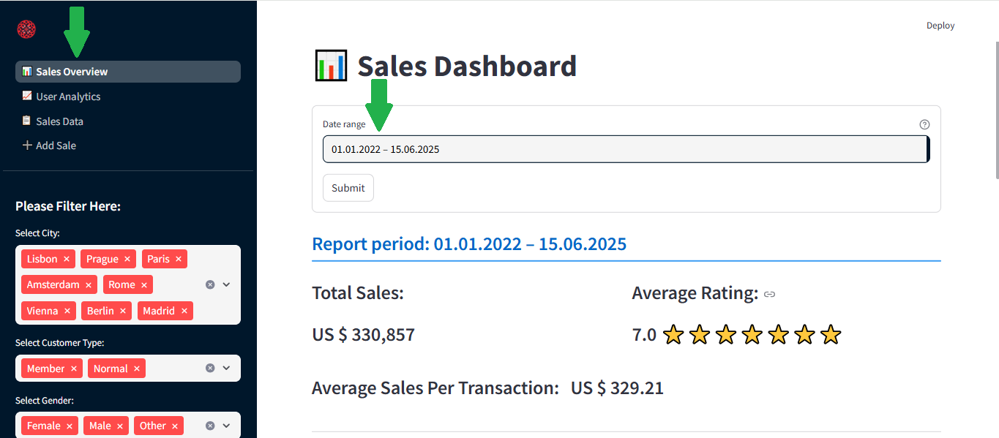
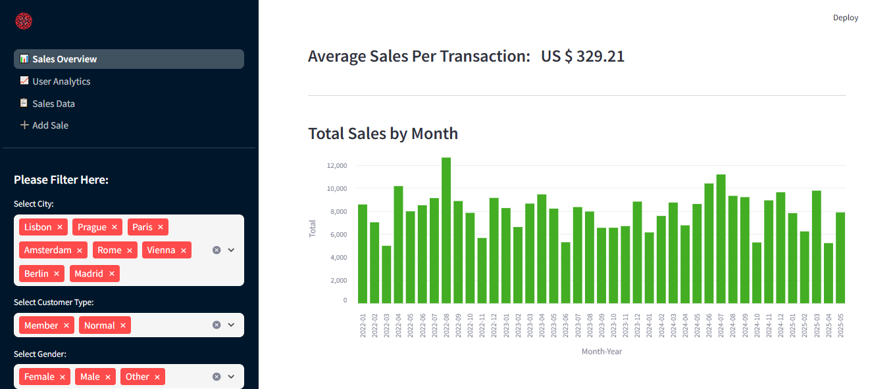
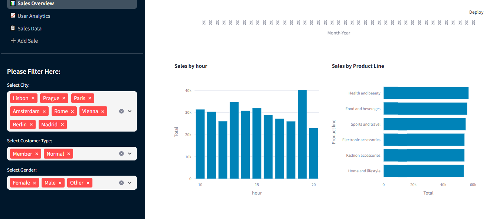
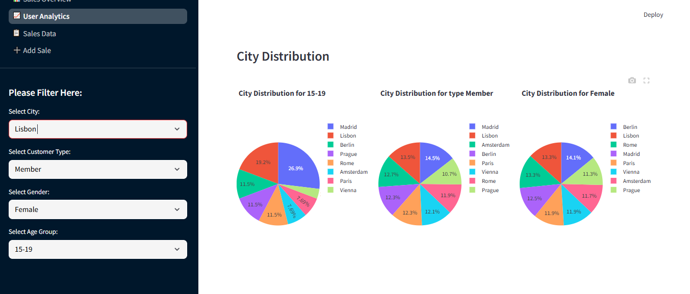
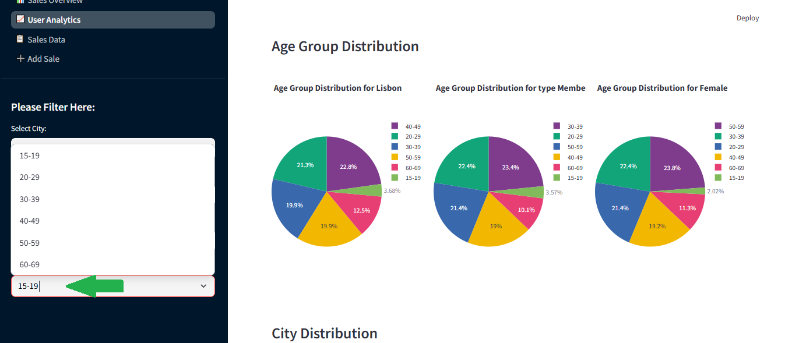
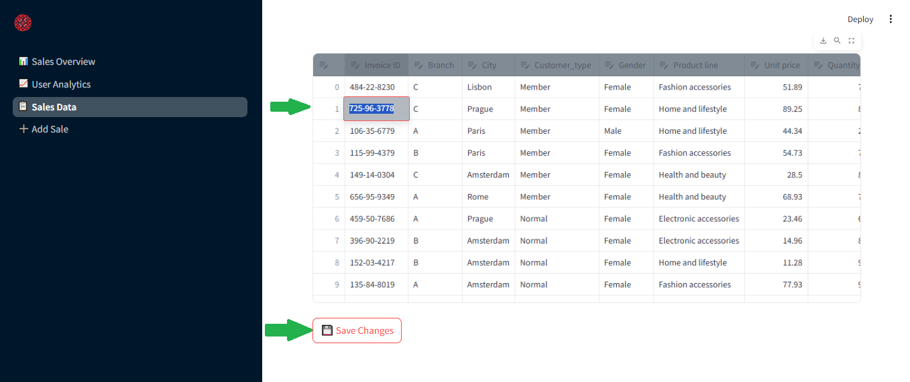
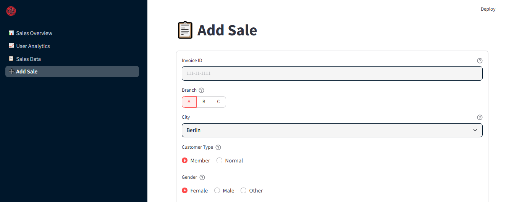
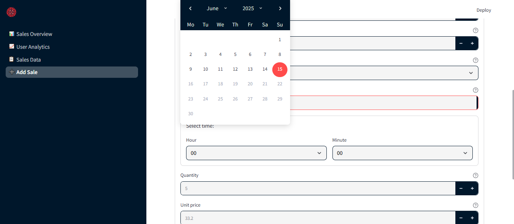

# Sales & User Analytics App

This is a Streamlit-based Python application designed to manage and analyze sales and user data. It provides a simple interface for visualizing statistics, exploring data, and editing records in an Excel file.

The app includes the following pages:

- 📊 **Sales Overview (sales_overview.py):**
  A dashboard with charts and key indicators summarizing overall sales performance.

- 📈 **User Analytics (user_analytics.py):**
  An analytical view of user-related data and behavior.

- 📋 **Sales Data (view_data.py):**
  Displays sales and user data from an Excel file in a table with filtering options. Users can view, explore, select, and edit specific records.

- ➕ **Add Sale (add_sale.py):**
  Allows users to add entries directly in the Excel file through a form-based interface.

This application is a lightweight and interactive alternative to Excel spreadsheets for small teams or individuals looking to track and manage both sales and user information in one place.

---

# Project Structure

```bash
├── .streamlit/                 # Streamlit config folder (theme, etc.)
│
├── images/                     # Folder for optional image assets
│
├── sales.xlsx                  # Main data file (Excel)
│
├── custom.css                 # Custom CSS styles
│
├── requirements.txt           # List of required Python packages
│
├── README.md                  # Project documentation
│
├── app.py                     # Main entry point
│
├── add_sale.py                # Page: Add new sale
├── view_data.py               # Page: View and edit raw sales data
├── sales_overview.py          # Page: Sales overview with filters and charts
├── user_analytics.py          # Page: User analytics (age, gender, city, etc.)
│
├── get_data.py                # Function: Load data from Excel
├── append_data.py             # Function: Append new sale to Excel
├── save_edited_data.py        # Function: Save edited data back to Excel
├── distribution_charts.py     # Function: Create visual charts (city distribution, etc.)
```

---

## 🛠️ Technologies Used

This project is built using the following technologies and libraries:

- **Python** – Core programming language used to build the app.
- **Streamlit** – A fast and easy framework for building interactive web applications with Python.
- **Pandas** – Powerful data manipulation and analysis library used for working with tabular data.
- **Openpyxl** – For reading and writing Excel files (.xlsx) directly.
- **Plotly** – Used for building interactive charts and visualizations.

All components are lightweight, open-source, and work well together in a Streamlit environment for building intuitive dashboards and tools.

---

# 🧑‍💻 Installation

1. Clone the repository:

```bash
git clone https://github.com/GannaKov/dashboard-python.git
cd dashboard-python
```

2. Install the required dependencies:

```bash
pip install -r requirements.txt
```

3. Run the application:

```bash
streamlit run app.py
```

4. Open in your browser

Navigate to: http://localhost:8501

---

# 📘 Usage

This application provides a streamlined dashboard for managing and analyzing sales data.

After running the app (`streamlit run app.py`), you can navigate through the following sections:

- **Sales Overview** – explore overall sales metrics and visual reports.
- **User Analytics** – dive into customer demographics and patterns.
- **Sales Data** – view and edit raw sales data directly in a table.
- **Add Sale** – input new sales manually using an easy-to-use form.

Each page is interactive and updates automatically based on selected filters or user input.  
All changes are reflected in real-time visualizations and statistics, making it easy to manage data without editing Excel manually.

---

# Pages

## 📊 Sales Overview

The Sales Overview page provides a high-level dashboard summarizing key sales metrics and trends. It helps users quickly assess performance and identify patterns over time.

### Key Features:

- Interactive Filtering:
  - Filter data by:
    - City
    - Customer Type
    - Gender
    - Date range (using a custom calendar picker)
  - Real-time updates of all metrics and charts based on selected filters
- Summary Metrics:
  - 💰 Total Sales — Sum of all sales in the selected period
  - ⭐ Average Rating — Mean customer rating, visualized with stars
  - 📉 Average Sales per Transaction — Indicates purchasing behavior
- Visual Charts:
  - Sales by Month (Bar Chart) — Tracks monthly revenue trends
  - Sales by Product Line (Horizontal Bar Chart) — Highlights top-performing product categories
  - Sales by Hour (Bar Chart) — Shows when most sales occur during the day
- Date Range Display:
  - Clearly indicates the selected reporting period in the dashboard header
- Empty State Handling:
  - Displays a warning message if filters return no data, ensuring users know to adjust their selections

This page is ideal for monitoring performance over time, understanding peak hours, and identifying top-selling categories.







---

## 📈 User Analytics

This page provides a comprehensive analytical view of user-related data and behavior. It allows you to:

### Key Features:

- Filter users by city, customer type, gender, and age group
- Select a custom date range for analysis
- Visualize distributions with interactive pie charts for:
  - Gender
  - Age Groups
  - Cities
  - Customer Types
- Drill down further to see how different demographic segments (e.g., gender, age group) vary across selected filters
- Analyze interrelations, such as:
  - Age group distribution by city, gender, and customer type
  - Gender distribution by age group, city, and customer type
  - Customer type distribution by gender, age group, and city

This dashboard helps uncover trends and patterns in customer demographics, supporting better business insights and decisions.





---

## 📋 Sales Data

The Sales Data page provides a tabular view of all sales and user data sourced from an Excel file. It allows users to browse, filter, and directly edit records in an intuitive spreadsheet-like interface.

### Key Features:

- Interactive Data Table:
  - View all sales records sorted by date for better readability
  - Use built-in Streamlit table filters and editing capabilities
  - Supports inline edits — users can update fields like totals, ratings, dates, and customer information
- Edit & Save:
  - After making changes, simply click the 💾 Save Changes button
  - Edits are saved back to the original Excel file using a custom save_edited_data() function
  - Includes feedback notifications for:
    - ✅ Successful save
    - ❌ Errors during saving
  - Automatically clears Streamlit's data cache to reflect real-time updates

This page offers a lightweight and user-friendly alternative to manually editing spreadsheets, especially useful for teams managing shared data or reviewing historical records.



---

## ➕ Add Sale

The Add Sale page provides a comprehensive form-based interface to add new sales records directly into the Excel dataset. It supports detailed input of all relevant sales fields, ensuring consistent and structured data entry.

### Key Features:

- User-Friendly Form:
  - Input fields for invoice ID, branch, city, customer type, gender, product line, age, rating, payment method, date, time, quantity, and unit price
  - Includes input validation with clear placeholders, min/max values, and helpful tooltips
  - Uses segmented controls, selectboxes, radios, and number inputs for intuitive selection
- Automatic Calculations:
  - Calculates tax (5%), total amount, cost of goods sold (COGS), gross margin percentage, and gross income automatically based on inputs
  - Displays computed financial metrics below the form for instant feedback
- Data Append & Feedback:
  - On submission, validates that all required fields are filled
  - Appends the new record to the Excel file via a custom append_data_to_excel() function
  - Shows success or error messages accordingly
  - Clears Streamlit’s cache to reflect changes immediately

This page streamlines adding sales data while minimizing errors, making it ideal for quick, accurate data entry by sales teams or analysts.





---

### just for me

sequential —
px.colors.sequential.Blues

px.colors.sequential.Viridis

px.colors.sequential.Oranges

px.colors.sequential.Plasma

px.colors.sequential.Cividis

px.colors.sequential.Magenta

✅ diverging —
px.colors.diverging.RdBu

px.colors.diverging.PuOr

px.colors.diverging.PiYG

px.colors.diverging.BrBG

✅ qualitative
px.colors.qualitative.Plotly

px.colors.qualitative.Bold

px.colors.qualitative.Pastel

px.colors.qualitative.Set3

px.colors.qualitative.Dark2

pip freeze > requirements.txt to generate a requirements.txt file with the current environment's packages
